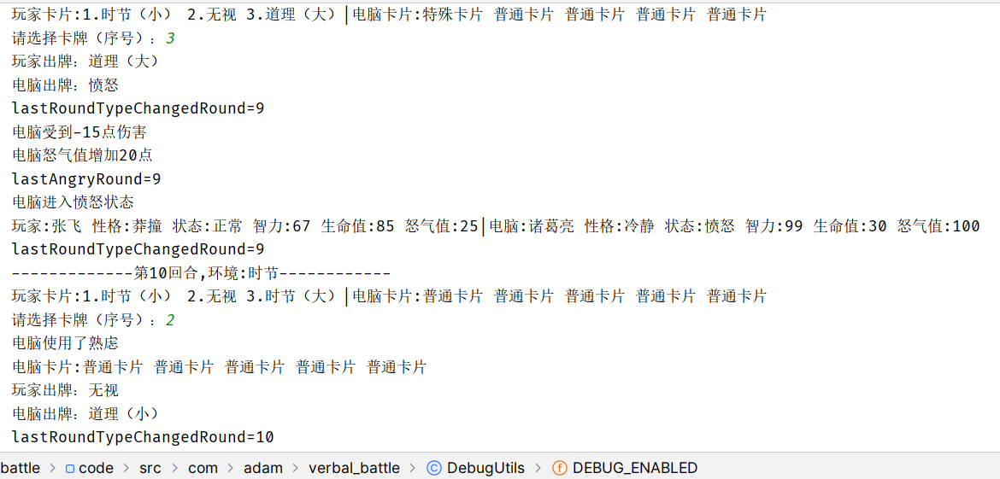
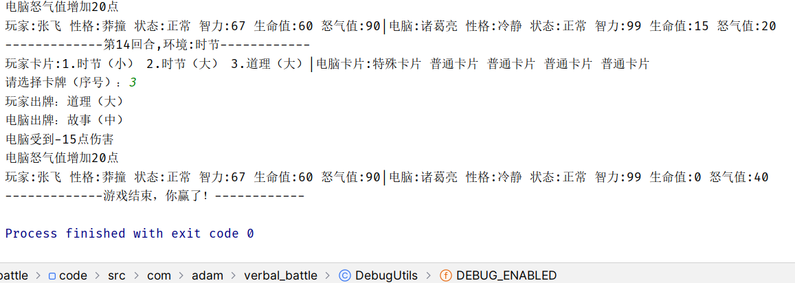

## 舌战（仿三国志11）

-------------
仿三国志11的舌战规则开发的舌战小游戏，JDK8开发，控制台程序。

游戏为玩家和电脑对决，以卡牌的方式战斗，当任何一方的生命值减至0时
对手获胜。

在游戏过程中，当玩家或电脑的怒气值达到100时会进入愤怒状态，此时
根据玩家或电脑的性格会发挥不同的效果：
- 胆小：一次性出完手中的所有卡牌
- 冷静：每回合可以通过熟虑重新发牌，持续3回合
- 莽撞：一次性给予对手生命值伤害
- 刚毅：使对手的普通卡牌无效

卡牌分为普通卡牌(NormalCard)和特殊卡牌(SpecialCard)，根据
力量的大小给予对手生命值伤害。

普通卡牌按环境分有故事、时节、道理三种，按力量分有大、中、小三种。

特殊卡牌包括大喝、无视、愤怒、冷静。
- 大喝：给予对手生命值伤害
- 无视：无视对手的卡牌并使对手的怒气值升高
- 愤怒：提高自身的怒气值
- 冷静：降低对手的怒气值

回合（Round），上一回合获胜的人在本回合为先手。

回合的输赢判定规则在VerbalBattleGame#roundJudge方法中，其中
玩家 出的牌会记录在round.artificialMove中，电脑出的牌会记录在
round.computerMove中。卡牌的效果以及愤怒效果的发动在
VerbalBattleGame#roundTakeEffects方法中。

### v1.1版本
引入愤怒状态及相应的处理机制，优化合并了部分代码。

### v1.0版本
初始版本，实现了除愤怒状态外的基本逻辑。根据预设的特殊牌概率发放
特殊牌，发牌、电脑出牌策略为随机。